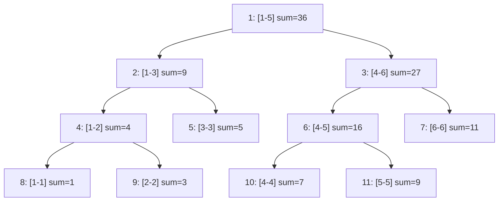

# 算法与数据结构

### 搜索

#### 双向搜索

##### 双向同时搜索

基本思路是从状态图上的起点和终点同时开始进行广搜或深搜。如果发现搜索的两端相遇了，那么可以认为是获得了可行解。(例题不使用双向也是可以的)

**例题：**

[P1379 八数码难题 - 洛谷](https://www.luogu.com.cn/problem/P1379)

**代码：**

```c++
#include <iostream>
#include <map>
#include <queue>
#include <string>
using namespace std;

struct State {
  int A[3][3];
  State() = default;

  State(string s) {
    for (int i = 0; i < 3; i++) {
      for (int j = 0; j < 3; j++) {
        A[i][j] = s[i * 3 + j] - '0';
      }
    }
  }

  friend bool operator<(const State &a, const State &b) {
    for (int i = 0; i < 3; i++) {
      for (int j = 0; j < 3; j++) {
        if (a.A[i][j] != b.A[i][j]) {
          return a.A[i][j] < b.A[i][j];
        }
      }
    }
    return false;
  }
};

int dir[4][2] = {{1, 0}, {-1, 0}, {0, 1}, {0, -1}};

void bfs(queue<State> &q, map<State, int> &m1, map<State, int> &m2) {
  auto u = q.front();
  q.pop();
  int xx, yy;
  for (int i = 0; i < 3; i++) {
    for (int j = 0; j < 3; j++) {
      if (u.A[i][j] == 0) {
        xx = i;
        yy = j;
      }
    }
  }
  for (int i = 0; i < 4; i++) {
    int tx = dir[i][0] + xx, ty = dir[i][1] + yy;
    if (tx >= 0 && tx < 3 && ty >= 0 && ty < 3) {
      auto v = u;
      swap(v.A[xx][yy], v.A[tx][ty]);
      if (m2.count(v)) {
        cout << m1[u] + m2[v] << endl;
        exit(0);
      }
      if (!m1.count(v)) {
        m1[v] = m1[u] + 1;
        q.push(v);
      }
    }
  }
}

int main() {
  string I, O;
  cin >> I;
  O = "123804765";
  State in = I, ou = O;
  queue<State> q1, q2;
  map<State, int> mp1, mp2;
  q1.push(in);
  mp1[in] = 0;
  q2.push(ou);
  mp2[ou] = 1;
  if (I == O) {
    cout << 0;
    return 0;
  }
  while (1) {
    bfs(q1, mp1, mp2);
    bfs(q2, mp2, mp1);
  }
  return 0;
}
```


##### 折半搜索(meet in middle)

将整个搜索过程分成两半，分别搜索，最后将两半的结果合并。


### 动态规划

#### 状压DP

状压DP通过**位运算**将复杂的状态压缩为整数或位集，从而高效处理状态转移。

**例题**

 [蓝桥杯 2024 国 B\ 跳石头 - 洛谷](https://www.luogu.com.cn/problem/P10914)

**代码**

```c++
#include <iostream>
#include <bitset>
using namespace std;

const int MAXN = 40005;

int n, c[MAXN], maxx = 0;
bitset<MAXN> dp[MAXN];

int main() {
    cin >> n;
    for (int i = 1; i <= n; ++i) {
        cin >> c[i];
    }
    for (int i = n; i >= 1; --i) {
        dp[i].reset();
        dp[i].set(c[i]);
        int j1 = i + c[i];
        if (j1 <= n) {
            dp[i] |= dp[j1];
        }
        int j2 = 2 * i;
        if (j2 <= n) {
            dp[i] |= dp[j2];
        }
        maxx = max(maxx, (int)dp[i].count()); // 注意这里 (int) 类型转化
    }
    cout << maxx << endl;
    return 0;
}
```


### 图论

#### 最短路

##### Floyd算法

**用途**：求**任意**两个节点间最短路，适用任何图。

**实现**：f[x] [y] = min(f[x] [k] + f[k] [y]),f[x] [y] 就是节点x 到节点y 的最短路长度。

**代码示例**：

```c++
for (int k = 1; k <= n; k++) {  //这里的k就表示中间经过的结点
  for (int x = 1; x <= n; x++) {
    for (int y = 1; y <= n; y++) {
      f[x][y] = min(f[x][y], f[x][k] + f[k][y]);
    }
  }
}
```

**思考**：为什么这样能体现答案是完备正确的？

最外层k的含义就是，仅经过前k个中间节点，x到y的最短路，每一次更新相对“仅经过前k个中间节点”这个条件是完备的，最后一次更新后，也就完成了“可以经过所有节点的最短路”


##### Bellman–Ford 算法


##### Dijkstra 算法

**用途**：求解**非负权图**上**单源**最短路。

**实现**：

1.将节点分成两个子集，为已知最短路的点集（S）和未确定的点集（T），初始状态除了起点所有节点都为T。

2.重复以下操作：

​	1.从T中选取最短路长度最小的节点，移到S。

​	2.对刚刚移动的节点所有的出边进行松弛操作。

3.直至T集合空。

**示例代码**：

```c++
const int MAXN = 1e5 + 5;   // 根据题目规模调整最大顶点数
const int INF = 0x3f3f3f3f; // 满足 INF*2 < INT_MAX

struct Edge {
    int to;     // 目标顶点
    int weight; // 边权
};

struct Node {
    int distance;   // 当前距离
    int vertex_id;  // 顶点编号
    
    // 比较运算符重载
    bool operator>(const Node& other) const {
        return distance > other.distance;
    }
};

vector<Edge> graph[MAXN];    // 邻接表存图
int dist[MAXN];              // 存储最短距离
bool processed[MAXN];        // 标记最短距离是否已确定

// 优化堆内存分配，这个并不等同于集合T，可视为待处理缓冲区
// priority_queue 默认最大堆，而greater<>将优先队列改为最小堆
priority_queue<Node, vector<Node>, greater<>> pq; 

void dijkstra(int total_vertices, int start) {
    // 初始化距离数组
    memset(dist, 0x3f, (total_vertices + 1) * sizeof(int));
    // 初始化处理标记
    memset(processed, 0, (total_vertices + 1) * sizeof(bool));
    
    dist[start] = 0;
    pq.push({0, start});

    while (!pq.empty()) {
        // 提取当前最小距离顶点
        int u = pq.top().vertex_id;
        pq.pop();
        
        // 跳过已处理顶点（重要优化点）
        if (processed[u]) continue;
        processed[u] = true;

        // 遍历邻接边
        for (auto& edge : graph[u]) {
            int v = edge.to;
            int w = edge.weight;
            
            // 松弛操作
            if (dist[v] > dist[u] + w) {
                dist[v] = dist[u] + w;
                pq.push({dist[v], v}); // 允许重复入队，堆会自动处理
            }
        }
    }
}
```


##### Johnsen 算法


#### 最小生成树

最小生成树即为**边权和最小**的生成数。

##### Kruskal 算法

把所有边从小到大排列，选取最小且不会连通的边。

**例题**

[P1195 口袋的天空 - 洛谷](https://www.luogu.com.cn/problem/P1195)

**代码**

```c++
#include <algorithm>
#include <iostream>
using namespace std;

int fa[1010];  // 定义根节点
int n, m, k;

struct edge {
	int u, v, w;
}g[10010];

int count = 0;

void add(int u, int v, int w) {
	count++;
	g[count].u = u;
	g[count].v = v;
	g[count].w = w;
}

// 标准并查集
int findroot(int x) { 
	return fa[x] == x ? x : fa[x] = findroot(fa[x]); 
}

void Merge(int x, int y) {
	x = findroot(x);
	y = findroot(y);
	fa[x] = y;
}

bool cmp(edge A, edge B) { return A.w < B.w; }

// Kruskal 算法
void kruskal() {
  int tot = 0;  // 存已选了的边数
  int ans = 0;  // 存总的代价
  for (int i = 1; i <= m; i++) {
    int xr = findroot(g[i].u), yr = findroot(g[i].v);
    if (xr != yr) {   // 如果待加入的边根节点不一样
      Merge(xr, yr);  // 合并
      tot++;          // 边数增加
      ans += g[i].w;  // 代价增加
    }
    if (tot >= (n - k)) {  // 检查选的边数是否满足 k 个棉花糖
      cout << ans << '\n';
      return;
    }
  }
  cout << "No Answer\n";  // 无法连成
}

int main() {
  cin >> n >> m >> k;
  for (int i = 1; i <= n; i++) {  // 初始化
    fa[i] = i;
  }
  for (int i = 1; i <= m; i++) {
    int u, v, w;
    cin >> u >> v >> w;
    add(u, v, w);  // 添加边
  }
  sort(g + 1, g + m + 1, cmp);  // 先按边权排序
  kruskal();
  return 0;
}
```


##### Prim 算法

**例题**

[P3366 【模板】最小生成树 - 洛谷](https://www.luogu.com.cn/problem/P3366)

**代码**

```c++
// 二叉堆优化的Prim算法实现最小生成树(MST)
#include <cstring>
#include <iostream>
#include <queue>
using namespace std;

constexpr int MAX_N = 5050;      // 最大节点数
constexpr int MAX_M = 2e5 + 10;  // 最大边数

// 边结构体：to-目标节点, weight-边权重, next-下一条边的索引
struct Edge {
  int to, weight, next;
} edges[MAX_M * 2];  // 无向图需要存双向边

int node_count, edge_count;  // 节点数和边数
int head[MAX_N];             // 链式前向星的头指针数组
int edge_index = 0;          // 当前边的索引

int min_edge[MAX_N];         // 记录连接到每个节点的最小边权
bool in_mst[MAX_N];          // 标记节点是否已在MST中

int total_cost = 0;  		 // MST的总权值
int mst_node_count = 0;      // 已加入MST的节点计数

// 添加无向边
void addEdge(int u, int v, int w) {
  edge_index++;
  edges[edge_index] = {v, w, head[u]};
  head[u] = edge_index;
}

// 优先队列节点：node-节点编号, key-当前最小边权
struct QueueNode {
  int node, key;
};

// 优先队列比较函数（最小堆）
bool operator<(QueueNode const& a, QueueNode const& b) {
  return a.key > b.key;  // 小顶堆：权重小的优先
}

// 最小堆优化选择过程
// priority_queue 默认使用元素 operator< 比较，而前面已经重载 < 了
priority_queue<QueueNode> min_heap;  

void Prim() {
  // 初始化：所有边权设为无穷大
  memset(min_edge, 0x3f3f3f3f, sizeof(min_edge));
  min_edge[1] = 0;  // 从节点1开始（可任选起点）

  min_heap.push({1, 0});

  while (!min_heap.empty() && mst_node_count < node_count) {
    // 获取当前最小权值的节点
    int u = min_heap.top().node;
    int key = min_heap.top().key;
    min_heap.pop();

    // 跳过已处理的节点
    if (in_mst[u]) {
      continue;
    }

    // 将节点加入MST
    in_mst[u] = true;
    mst_node_count++;
    total_cost += key;

    // 遍历u的所有邻接边
    for (int i = head[u]; i; i = edges[i].next) {
      int v = edges[i].to;
      int w = edges[i].weight;

      // 如果找到更小的边权且v不在MST中
      if (!in_mst[v] && w < min_edge[v]) {
        min_edge[v] = w;
        min_heap.push({v, w});
      }
    }
  }
}

int main() {
  cin >> node_count >> edge_count;

  // 构建无向图
  for (int i = 1, u, v, w; i <= edge_count; ++i) {
    cin >> u >> v >> w;
    addEdge(u, v, w);
    addEdge(v, u, w);  // 无向图添加双向边
  }

  Prim();  // 执行Prim算法

  // 输出结果：如果包含所有节点则输出总权值，否则输出无解
  if (mst_node_count == node_count) {
    cout << total_cost;
  } else {
    cout << "orz";  // 图不连通，无法形成MST
  }

  return 0;
}
```


## 数据结构

#### 栈

**注意点**就是时刻要判断是否为**空**或者**溢出**。

```c++
#define MAX_SIZE 100

class Stack {
private:
    int arr[MAX_SIZE]; // 使用固定大小的数组存储数据
    int top;           // 栈顶元素的索引

public:
    // 构造函数：初始化栈
    Stack() {
        top = -1; // -1 表示栈为空
    }

    bool isFull() {
        return top == MAX_SIZE - 1;
    }

    bool isEmpty() {
        return top == -1;
    }

    void push(int x) {
        if (isFull()) {
            std::cout << "Error: Stack Overflow (栈溢出)" << std::endl;
            return;
        }
        // 1. 增加 top 索引
        // 2. 将元素存入 top 指向的位置
        arr[++top] = x;
        std::cout << x << " pushed into stack" << std::endl;
    }

    int pop() {
        if (isEmpty()) {
            std::cout << "Error: Stack Underflow (栈下溢)" << std::endl;
            return INT_MIN; // 返回一个哨兵值表示错误
        }
        // 1. 获取栈顶元素的值
        // 2. 减少 top 索引
        int x = arr[top--];
        return x;
    }

    int peek() {
        if (isEmpty()) {
            std::cout << "Error: Stack is empty (栈为空)" << std::endl;
            return INT_MIN; // 返回一个哨兵值表示错误
        }
        return arr[top];
    }
};
```


#### 链表

```c++
// 链表节点模板
template<typename T>
struct ListNode {
    T data;  // 该点的数据
    ListNode<T>* next;  // 指向下一个点的位置指针
    ListNode(const T& val) : data(val), next(nullptr) {}
};

// 链表模板类
template<typename T>
class LinkedList {
private:
    ListNode<T>* head;
    ListNode<T>* tail;

public:
    // 构造函数
    LinkedList() : head(nullptr), tail(nullptr) {}
    
    // 析构函数 ，有 new 操作，就要有相应的 delete
    ~LinkedList() {
        // 很常见的操作，就是用一个暂时的指针操作所有内容
        ListNode<T>* current = head;
        
        while (current) {
            ListNode<T>* next = current->next;
            delete current;
            current = next;
        }
    }
    
    // 尾部插入
    void push_back(const T& value) {
        // 先建立一个新的节点指针，并赋值value
        ListNode<T>* newNode = new ListNode<T>(value);
        
        // 注意链表思维，不是设置一个连贯的数组，而是将不同的数连接
        if (!head) {
            head = tail = newNode;
        } else {
            tail->next = newNode;
            tail = newNode;
        }
    }
    
    // 打印链表
    void print() const {
        ListNode<T>* current = head;
        while (current) {
            cout << current->data << " ";
            current = current->next;
        }
        cout << endl;
    }
    
    void reverse() {
        // 0. 如果链表为空或只有一个节点，无需反转
        if (head == nullptr || head->next == nullptr) {
            return;
        }
        
        // 1. 初始化三个指针
        // prev (前一个节点), current (当前节点), nextTemp (临时保存下一个节点)
        ListNode<T>* prev = nullptr;
        ListNode<T>* current = head;
        ListNode<T>* nextTemp = nullptr;
        
        // 2. 更新 tail 指针
        // 在反转开始前，旧的 head 将成为反转后的 new tail
        tail = head;
        
        // 3. 循环遍历并反转
        while (current != nullptr) {
            // 临时存储下一个节点
            nextTemp = current->next;
            
            // 反转当前节点的指针，指向前一个节点
            current->next = prev;
            
            // 移动 prev 和 current 指针，为下一次迭代做准备
            prev = current;
            current = nextTemp;
        }
        
        // 循环结束后, current 变为 nullptr, 而 prev 指向了新的头节点
        head = prev;
    }
};
```


#### 哈希表

##### 拉链法（开散列法）

每个存储位置开一个链表，若多个键值索引引向同一个地方，都放入同一个链表即可。

**代码实现**

```c++
constexpr int SIZE = 1e6;  //所有节点数量
constexpr int M = 1e6;  //哈希表大小

struct HashTable {
  struct Node {
    int next, value, key;
  } data[SIZE];

  int head[M], size;  //哈希桶 i 对应链表的第一个节点

  int f(int key) { 
      return (key % M + M) % M; //防止出现负数结果，% 运算无法将负数转为正数
  } 

  int get(int key) {
    for (int p = head[f(key)]; p; p = data[p].next)  //p为尾节点即结束
      if (data[p].key == key) return data[p].value;
    return -1;
  }

  int modify(int key, int value) {
    for (int p = head[f(key)]; p; p = data[p].next)
      if (data[p].key == key) return data[p].value = value;
  }

  int add(int key, int value) {
    if (get(key) != -1) return -1;  //防止重复插入，即key相同
    data[++size] = Node{head[f(key)], value, key};
    head[f(key)] = size;
    return value;
  }
};
```

**模板封装**

```c++
constexpr int MAX_NODES = 1e6;  // 最大节点数量（存储 key-value 对）
constexpr int HASH_SIZE = 1e6;  // 哈希表桶数量

struct HashMap {
  struct Node {
    long long key;  // 键
    int value;      // 值
    int next;       // 指向下一个节点的索引
  };

  Node nodes[MAX_NODES << 1];  // 所有节点的数组
  int head[HASH_SIZE];         // 每个桶的链表头索引
  int node_count;              // 当前节点数量（相当于 next_index）

  // 构造函数：初始化
  HashMap() {
    node_count = 0;
    memset(head, 0, sizeof(head));
  }
    
  // 哈希函数
  int hash(long long key) const {
    return (key % HASH_SIZE + HASH_SIZE) % HASH_SIZE;
  }

  // 查找或创建节点，并返回 value 的引用
  int& operator[](long long key) {
    int bucket = hash(key);  // 对 key 取模确定桶号
    for (int i = head[bucket]; i; i = nodes[i].next) {
      if (nodes[i].key == key)
        return nodes[i].value;  // 找到已有 key
    }

    // 未找到 -> 插入新节点
    ++node_count;
    nodes[node_count] = Node{key, -1, head[bucket]};
    head[bucket] = node_count;
    return nodes[node_count].value;
  }
};

```


##### 闭散列法

闭散列方法把所有记录直接存储在散列表中，如果发生冲突则根据某种方式继续进行探查。

比如线性探查法：如果在 `d` 处发生冲突，就依次检查 `d + 1`，`d + 2`……

**代码实现**

```c++
constexpr int N = 1e7;  // 最大可以存储的元素数量

class Hash {
 private:
  int keys[N];
  int values[N];

 public:
  Hash() { 
      memset(values, 0, sizeof(values)); 
  }

  int& operator[](int n) {
    // 返回一个指向对应 Hash[Key] 的引用
    // 修改成不为 0 的值 0 时候视为空
    int idx = (n % N + N) % N;  //取哈希下标
    int cnt = 1;
    while (keys[idx] != n && values[idx] != 0) {
      idx = (idx + cnt * cnt) % N; //二次探测，并非线性聚集
      cnt += 1;
    }
    keys[idx] = n;
    return values[idx];
  }
};
```


#### 线段树

**特点：**

根节点表示整个区间[1,n]，非叶子节点地柜二分区间，叶子结点储存单个元素值。



**核心操作时间复杂度** ：

|   操作   | 时间复杂度 |
| :------: | :--------: |
|   建树   |    O(n)    |
| 区间查询 |  O(log n)  |
| 区间更新 |  O(log n)  |
| 单点更新 |  O(log n)  |

**例题：**

[P3372 【模板】线段树 1 - 洛谷](https://www.luogu.com.cn/problem/P3372)

**代码：**

```c++
#include <iostream>
using namespace std;
using LL = long long;  

#define MAX_N 100005
#define MAX_TREE_SIZE 220000

LL n;  // 序列长度                                
LL orig_arr[MAX_N];  // 原始数组                 
LL seg_tree[MAX_TREE_SIZE];  // 线段树储存区间和         
LL lazy[MAX_TREE_SIZE];  // 懒标记

// 构建线段树
void build(LL left, LL right, LL node_idx) {
  if (left == right) {
    seg_tree[node_idx] = orig_arr[left];
    return;
  }

  // 分治
  LL mid = left + ((right - left) >> 1); // 防止溢出

  build(left, mid, node_idx << 1);
  build(mid + 1, right, (node_idx << 1) | 1);

  seg_tree[node_idx] = seg_tree[node_idx << 1] + seg_tree[(node_idx << 1) | 1];  // 回溯更新当前节点
}

// 区间更新
void update(LL left, LL right, LL delta, LL curr_left, LL curr_right, LL node_idx) {
  // 区间完全被覆盖就更新 （这里的解释放在最后面）
  if (left <= curr_left && curr_right <= right) {
    seg_tree[node_idx] += (curr_right - curr_left + 1) * delta;
    lazy[node_idx] += delta; 
    return;
  }

  LL mid = curr_left + ((curr_right - curr_left) >> 1);
  if (lazy[node_idx]) {
    // 更新之前未更新的懒标记
    seg_tree[node_idx << 1] += lazy[node_idx] * (mid - curr_left + 1);
    seg_tree[(node_idx << 1) | 1] += lazy[node_idx] * (curr_right - mid);

    // 下推懒标记
    lazy[node_idx << 1] += lazy[node_idx];
    lazy[(node_idx << 1) | 1] += lazy[node_idx];
    lazy[node_idx] = 0; // 清除当前标记
  }

  if (left <= mid) {
    update(left, right, delta, curr_left, mid, node_idx << 1);
  }
  if (right > mid) {
    update(left, right, delta, mid + 1, curr_right, (node_idx << 1) | 1);
  }

  // 更新当前节点区间和
  seg_tree[node_idx] = seg_tree[node_idx << 1] + seg_tree[(node_idx << 1) | 1];
}

// 区间查询(这里是特例查询和)
LL query_sum(LL qry_left, LL qry_right, LL curr_left, LL curr_right, LL node_idx) {
  // 当前节点区间完全在查询区间内
  if (qry_left <= curr_left && curr_right <= qry_right) {
    return seg_tree[node_idx];
  }

  LL mid = curr_left + ((curr_right - curr_left) >> 1);
  // 下推现有惰性标记（与上面相同含义）
  if (lazy[node_idx]) {
    seg_tree[node_idx << 1] += lazy[node_idx] * (mid - curr_left + 1);
    seg_tree[(node_idx << 1) | 1] += lazy[node_idx] * (curr_right - mid);
    lazy[node_idx << 1] += lazy[node_idx];
    lazy[(node_idx << 1) | 1] += lazy[node_idx];
    lazy[node_idx] = 0;  // 清除当前标记
  }

  LL sum = 0;
  // 递归查询左右子树
  if (qry_left <= mid) {
    sum = query_sum(qry_left, qry_right, curr_left, mid, node_idx << 1);
  }
  if (qry_right > mid) {
    sum += query_sum(qry_left, qry_right, mid + 1, curr_right, (node_idx << 1) | 1);
  }

  return sum;
}

int main() {
  ios::sync_with_stdio(false);  
  cin.tie(nullptr);             

  LL query_count;  
  cin >> n >> query_count;

  for (LL i = 1; i <= n; ++i) {
    cin >> orig_arr[i];
  }

  build(1, n, 1);

  while (query_count--) {
    LL op_type, left_bound, right_bound;
    cin >> op_type >> left_bound >> right_bound;

    if (op_type == 2) {  
      cout << query_sum(left_bound, right_bound, 1, n, 1) << '\n';
    } else {
      LL delta;
      cin >> delta;
      update(left_bound, right_bound, delta, 1, n, 1);
    }
  }
  return 0;
}

/*
原始数据[1,7]  更新[2,5]  更新区间未能完全包含被更新区间
查询[1,3],[4,6] 都不满足，继续递归子节点
查询[1,2]过 [3,3]被完全包含，更新 [4,5]被完全覆盖，更新 [6,6]过
*/
```


#### 堆

​	堆是一棵树，其每个节点都有一个键值，且每个节点的键值**都大于等于/小于等于**其父亲的键值。

​	每个节点的键值都大于等于其父亲键值的堆叫做小根堆，否则叫做大根堆（就是根是“最大”还是“最小”）。STL 中的 priority_queue 其实就是一个大根堆。

​	（小根）堆主要支持的操作有：插入一个数、查询最小值、删除最小值、合并两个堆、减小一个元素的值。一些功能强大的堆（可并堆）还能（高效地）支持 merge 等操作。一些功能更强大的堆还支持可持久化，也就是对任意历史版本进行查询或者操作，产生新的版本。

| 操作                            | 配对堆                                                       | 二叉堆      | 左偏树      | 二项堆      | 斐波那契堆  |
| :------------------------------ | :----------------------------------------------------------- | :---------- | :---------- | :---------- | :---------- |
| 插入 (insert)                   | $O(1)$                                                       | $O(\log n)$ | $O(\log n)$ | $O(\log n)$ | $O(1)$      |
| 查询最小值 (find-min)           | $O(1)$                                                       | $O(1)$      | $O(1)$      | $O(1)$      | $O(1)$      |
| 删除最小值 (delete-min)         | $O(\log n)$                                                  | $O(\log n)$ | $O(\log n)$ | $O(\log n)$ | $O(\log n)$ |
| 合并 (merge)                    | $O(1)$                                                       | $O(n)$      | $O(\log n)$ | $O(\log n)$ | $O(1)$      |
| 减小一个元素的值 (decrease-key) | $o(\log n)$ (下界 $\Omega(\log \log n)$, 上界 $O(2^{2\sqrt{\log \log n}})$) | $O(\log n)$ | $O(\log n)$ | $O(\log n)$ | $O(1)$      |
| 是否支持可持久化                | ×                                                            | ✓           | ✓           | ✓           | ×           |


##### 二叉堆

​	是完全二叉树（并非满二叉树），以下都以**大根堆**为例。

**插入操作**

​	在最下层最右边的叶子之后插入（如果最下层已满就再下一层插入）。若插入之后不满足堆性质，就**向上调整**：如果这个结点的权值大于它父亲的权值，就**交换**，重复此过程直到不满足或者到根。时间复杂度$O(logn)$。

**改变节点权值**

​	判断时需要**“上浮”**还是**“下沉”**操作，然后不断地与父节点或者子节点做交换操作，直至到边缘或者不能再交换。时间复杂度即路径长度即树的高度$O(logn)$。

**删除操作**

​	即指删除堆中的根节点。采取**向下调整**：即找到节点最大的儿子，并**交换**，直到到底层。时间复杂度$O(logn)$。

​	如果删除的不是根节点，那我们找到这个节点，再与**最后一个节点交换**，再删除最后一个节点（此时这个节点即为需要删除的节点，完成了删除操作），再对原来位置的节点进行**“上浮”**或者**“下沉”**的操作（这里其实就是对交换后的节点采取“**改变节点权值**”的操作）。时间复杂度仍为$O(logn)$（找节点的过程可能为$O(n)$）。

**建堆**

​	直接一个一个插入调整时间复杂度在$O(nlogn)$​，我们采取**“向下调整”**的策略：

- 找到**第一个非叶子节点**，即在一个使用数组（0 to n-1 索引）表示的完全二叉树中，最后一个非叶子节点的索引是 $\lfloor n/2 \rfloor - 1$。
- 从索引 `i = (n/2) - 1` 开始到 `i = 0`  ，对以 `i` 为根的小子树操作确保以 `i` 为根的这个小“子堆”(注意这里可能需要多次递归交换)满足大根堆的性质。
- 向前迭代 `i`（`i--`），对下一个非叶子节点（`i-1`）执行相同的操作，直到 `i = 0`（即根节点）也完成了“下沉”操作。

​	时间复杂度：$O(n)$，之所以时间复杂度很低，是因为其实堆的性质很弱。

**代码：**

```c++
// 这里还是以大根堆为例
class MaxHeap {
private:
    std::vector<int> heap_array;

    // 获取父节点索引
    int parent(int i) { return (i - 1) / 2; }
    // 获取左子节点索引
    int left(int i) { return 2 * i + 1; }
    // 获取右子节点索引
    int right(int i) { return 2 * i + 2; }

    // 向上调整 (上浮/Bubble-up) 操作。用于插入和增加权值。
    void siftUp(int i) {
        // 当 i > 0 (不是根节点) 且 i 的值大于父节点的值时，持续交换
        while (i > 0 && heap_array[i] > heap_array[parent(i)]) {
            std::swap(heap_array[i], heap_array[parent(i)]);
            i = parent(i); // 移动到父节点位置，继续向上检查
        }
    }

    // 向下调整 (下沉/Sift-down) 操作。用于删除根节点、建堆和减少权值。
    void siftDown(int i) {
        int largest = i,n = heap_array.size();
        int l = left(i),r = right(i);

        // 找到 i, 左子, 右子中最大的那个
        if (l < n && heap_array[l] > heap_array[largest]) {
            largest = l;
        }
        if (r < n && heap_array[r] > heap_array[largest]) {
            largest = r;
        }

        // 如果 i 不是最大的，则与最大的子节点交换，并递归下沉
        if (largest != i) {
            std::swap(heap_array[i], heap_array[largest]);
            siftDown(largest); // 递归向下调整
        }
    }

public:
    // --- 1. 插入操作 (O(log n)) ---
    void insert(int value) {
        // 1. 在最下层最右边的叶子之后插入 (即 push_back)
        heap_array.push_back(value);
        int i = heap_array.size() - 1;

        // 2. 向上调整以维持堆性质
        siftUp(i);
    }

    // --- 2. 改变节点权值操作 (O(log n)) ---
    void changeKey(int i, int new_value) {
        if (i < 0 || i >= heap_array.size()) {
            throw std::out_of_range("Index out of bounds.");
        }

        int old_value = heap_array[i];
        heap_array[i] = new_value;

        // 判断需要“上浮”还是“下沉”
        if (new_value > old_value) {
            // 权值增加，可能违反父节点属性，需要上浮
            siftUp(i);
        } else if (new_value < old_value) {
            // 权值减少，可能违反子节点属性，需要下沉
            siftDown(i);
        }
        // 如果 new_value == old_value, 不做任何操作
    }

    // --- 3. 删除操作 (O(log n) 或 O(n) 取决于查找) ---

    // 3.1 删除根节点 (delete-max) (O(log n))
    int deleteMax() {
        if (heap_array.empty()) {
            throw std::out_of_range("Heap is empty.");
        }
        if (heap_array.size() == 1) {
            int max_val = heap_array[0];
            heap_array.pop_back();
            return max_val;
        }

        // 1. 根节点与最后一个元素交换
        int max_val = heap_array[0];
        heap_array[0] = heap_array.back();
        heap_array.pop_back();

        // 2. 对新的根节点向下调整
        siftDown(0);
        return max_val;
    }

    // 3.2 删除任意节点 i (O(log n) 如果已知索引 i)
    void deleteNode(int i) {
        if (i < 0 || i >= heap_array.size()) {
            throw std::out_of_range("Index out of bounds.");
        }

        // 1. 将该节点的值改为一个非常大的值 (确保它会上浮到根)
        // 也可以直接和最后一个节点交换，然后使用 changeKey()，这里用更直接的方法：
        
        // 1. 和最后一个节点交换，并删除
        std::swap(heap_array[i], heap_array.back());
        heap_array.pop_back();

        // 如果被交换到 i 位置的元素 (原来的最后一个元素) 仍在堆中
        if (i < heap_array.size()) {
            // 2. 对 i 位置的元素进行调整 (需要判断上浮还是下沉)
            // 这里我们无法判断新值与旧值的关系，因此需要同时尝试上浮和下沉（其中一个会失败或立刻停止）
            // 更简便的方法是直接调用 changeKey(i, heap_array[i])，但我们手写逻辑：
            
            // 因为不知道是上浮还是下沉，我们先尝试下沉（如果下沉不成功，说明堆可能被破坏）
            siftDown(i);
            
            // 如果下沉操作后该元素仍不满足堆属性（可能它需要上浮），我们再尝试上浮
            // 例如：如果被交换上来的值是最小的，它会一直下沉到底。
            // 但如果被交换上来的值大于父节点，它需要上浮。
            siftUp(i); 
            // 注意：siftDown和siftUp只能发生一个，另一个操作会在第一步就停止。
        }
    }


    // --- 4. O(n) 建堆操作 (Heapify) ---
    void buildHeap(const std::vector<int>& data) {
        heap_array = data; // 复制数据
        int n = heap_array.size();

        // 从最后一个非叶子节点开始 (即 (n/2) - 1)，自下而上进行下沉
        // @complexity O(n)
        for (int i = (n / 2) - 1; i >= 0; i--) {
            siftDown(i);
        }
    }

    // --- 打印/辅助函数 ---
    void printHeap() const {
        std::cout << "Heap Array: [";
        for (size_t i = 0; i < heap_array.size(); ++i) {
            std::cout << heap_array[i] << (i == heap_array.size() - 1 ? "" : ", ");
        }
        std::cout << "]" << std::endl;
    }
};

int main() {
    MaxHeap heap;
    std::cout << "--- 4. 建堆操作 (O(n)) ---" << std::endl;
    std::vector<int> initial_data = {1, 2, 3, 4, 5, 6, 7, 8, 9, 10};
    heap.buildHeap(initial_data);
    std::cout << "After O(n) buildHeap: ";
    heap.printHeap(); // 预期: [10, 9, 7, 8, 5, 6, 3, 1, 4, 2] (或等价的堆)

    std::cout << "\n--- 1. 插入操作 (O(log n)) ---" << std::endl;
    heap.insert(15);
    std::cout << "After insert(15): ";
    heap.printHeap(); // 15 会上浮到根

    std::cout << "\n--- 2. 改变节点权值 (O(log n)) ---" << std::endl;
    // 假设索引 7 是值 1
    // 将索引 7 (值 1) 变为 20 (增加权值，触发上浮)
    // 找到 1 的索引 (在我们的例子中，假设是 7)
    int index_of_one = 7; 
    heap.changeKey(index_of_one, 20); 
    std::cout << "After changeKey(idx=7, val=20): ";
    heap.printHeap(); // 20 会再次上浮到根

    // 假设索引 0 (值 20) 变为 0 (减少权值，触发下沉)
    heap.changeKey(0, 0); 
    std::cout << "After changeKey(idx=0, val=0): ";
    heap.printHeap(); // 0 会下沉

    std::cout << "\n--- 3. 删除根节点 (O(log n)) ---" << std::endl;
    int max_val = heap.deleteMax();
    std::cout << "Deleted Max Value: " << max_val << std::endl;
    std::cout << "After deleteMax: ";
    heap.printHeap();

    std::cout << "\n--- 3. 删除任意节点 (O(log n) 假设已知索引) ---" << std::endl;
    // 假设我们要删除索引 3 的节点
    int index_to_delete = 3; 
    std::cout << "Deleting node at index " << index_to_delete << std::endl;
    heap.deleteNode(index_to_delete);
    std::cout << "After deleteNode(idx=3): ";
    heap.printHeap();

    return 0;
}
```


##### 对顶堆

​	同时使用一个大根堆和小根堆，并且**大根堆**所有元素**小于**小根堆所有元素，且保证**小根堆**的元素数量**始终等于**K(K可以是变化的)。目的是实时找到第K个大的数。

**插入新元素**

​	先将元素插入致大根堆，然后将大根堆的堆顶给小根堆，如果小跟堆元素数量多于K，则把堆顶给大根堆。时间复杂度$O(logN)$。


##### 配对堆

​	配对堆是满足堆性质的带权多叉树（"多叉小根堆"）。通常用儿子-兄弟表示法储存，即一个节点的所有儿子节点形成一个单向链表，每个节点储存第一个儿子的指针（链表头节点）和它的右兄弟指针。

​	

#### 树

##### 二叉树


```c++
// 定义二叉树节点
struct TreeNode {
    int val;
    TreeNode *left;
    TreeNode *right;

    // 构造函数
    TreeNode(int x) : val(x), left(nullptr), right(nullptr) {}
};
```
我们可以使用**递归**或者**迭代**的方式实现前序、中序或者后续的遍历。而递归的方式很容易造成栈溢出，所以下面都用迭代的方式实现。

**前序遍历**
顺序：**根 -> 左 -> 右**

```c++
std::vector<int> preorderTraversalIterative(TreeNode* root) {
    std::vector<int> result;
    if (root == nullptr) {
        return result;
    }

    std::stack<TreeNode*> s;
    s.push(root);

    while (!s.empty()) {
        TreeNode* node = s.top();
        s.pop();

        result.push_back(node->val); // 1. 访问 根

        // 2. 先压入 右 子节点 (因为它后被访问)
        if (node->right != nullptr) {
            s.push(node->right);
        }
        // 3. 再压入 左 子节点 (因为它先被访问)
        if (node->left != nullptr) {
            s.push(node->left);
        }
    }
    return result;
}
```
**中序遍历**
顺序：**左 -> 根 -> 右**
先一直向左压，再看根节点和右节点

```c++
std::vector<int> inorderTraversalIterative(TreeNode* root) {
    std::vector<int> result;
    std::stack<TreeNode*> s;
    TreeNode* curr = root;

    // 当 curr 不为空 (还要往左走) 或 栈不为空 (还有节点待处理)
    while (curr != nullptr || !s.empty()) {
        // 1. 一直向左，将路径上的节点全部压栈
        while (curr != nullptr) {
            s.push(curr);
            curr = curr->left;
        }

        // 2. 此时 curr 为空，说明走到了最左边
        // 从栈顶取出一个节点 (这就是 "左")
        curr = s.top();
        s.pop();

        // 3. 访问 根
        result.push_back(curr->val);

        // 4. 转向 右 子树
        curr = curr->right;
    }
    return result;
}

```
**后序遍历**
顺序：**左 -> 右 -> 根**
后序(左->右->根) 是 前序(根->左->右) 的一种镜像 (根->右->左) 的逆序， 我们可以先实现 (根->右->左)，然后将结果反转。

```c++
std::vector<int> postorderTraversalIterative(TreeNode* root) {
    std::vector<int> result;
    if (root == nullptr) {
        return result;
    }

    std::stack<TreeNode*> s;
    s.push(root);

    while (!s.empty()) {
        TreeNode* node = s.top();
        s.pop();

        result.push_back(node->val); // 1. 访问 根

        // 2. 先压入 左 子节点
        if (node->left != nullptr) {
            s.push(node->left);
        }
        // 3. 再压入 右 子节点
        if (node->right != nullptr) {
            s.push(node->right);
        }
    }
    
    // 此时 result 中的顺序是 (根 -> 右 -> 左)，将其反转，得到 (左 -> 右 -> 根)
    std::reverse(result.begin(), result.end());
    return result;
}
```


##### 二叉搜索树

性质：**左子树所有**节点的值**小于根节点**，**右子树所有**节点的指大于**根节点**


## 字符串

#### 前缀函数与KMP

**定义：**

给定一个长度为𝑛的字符串𝑠，其**前缀函数**被定义为一个长度为𝑛的数组𝜋。其中𝜋[𝑖]的定义是：

$\begin{aligned}&1.\text{ 如果子串 }s[0...i]\text{ 有一对相等的真前缀与真后缀:}s[0...i]\text{ 和 }s[i-(k-1)...i]\text{,那么 }\pi[i]\\&\text{就是这个相等的真前缀(或者真后缀,因为它们相等)的长度,也就是 }\pi[i]=k;\\&2.\text{ 如果不止有一对相等的,那么 }\pi[i]\text{ 就是其中最长的那一对的长度;}\\&3.\text{ 如果没有相等的,那么 }\pi[i]=0。\end{aligned}$

简单来说π[i]就是，子串s[0...i]最长的相等的真前缀与真后缀的长度。

特别地，规定π[0]=0![\pi[0]=0](data:image/gif;base64,R0lGODlhAQABAIAAAAAAAP///yH5BAEAAAAALAAAAAABAAEAAAIBRAA7)。

**举例：**

对于字符串 abcabcd,
π[0]=0，因为a没有真前缀和真后缀，根据规定为0
π[1]=0，因为ab无相等的真前缀和真后缀
π[2]=0，因为abc无相等的真前缀和真后缀
π[3]=1，因为abca只有一对相等的真前缀和真后缀：a,长度为1
π[4]=2，因为abcab相等的真前缀和真后缀只有：ab,长度为2
π[5]=3，因为abcabc相等的真前缀和真后缀只有：abc,长度为3
π[6]=0，因为abcabcd无相等的真前缀和真后缀
同理，可以计算字符串 aabaaab 的前缀函数为[0,1,0,1,2,2,3]。

**算法优化：**
重要观察：**相邻**的前缀函数值**至多**增加 1。
定义：$j^{(n)}_m$ 为子串 $s[0...m]$ 的第 $n$ 大前缀函数值，易得 $\pi[i]=j^{(1)}_{i}$。

计算位置 `i` 的前缀函数时， $j^{(1)}=π[i−1]$。

若某一候选$j^{(k)}>0$且$ s[i]\ne s[j^{(k)}]$，说明该候选不能扩展，需要把候选缩短为该候选自身的最大真前缀长度，故取$j^{(k+1)}=\pi[j^{(k)}-1].$

即转移方程：$j^{(n)}=\pi[j^{(n-1)}-1],(j^{(n-1)}>0)$。

若$j^{(k)}>0$且$s[i] = s[j^{(k)}]$，说明当前字符可以成功扩展已有的前缀匹配，新的匹配长度即为：$\pi[i]=j^{(k)}+1.$

**举例：**

以 ababababac 为例，计算最后一个字符对应的 $\pi[9]$：
前缀函数到第 8 位的值为 $\pi[8]=7$（对应前缀 "abababa"）。
比较字符：$s[9]=c$ 与 $s[\pi[8]]=s[7]=b$ 不匹配，发生回退。
根据转移方程：$j^{(2)}=\pi[\pi[8]-1]=\pi[6]=5$。
继续比较：$s[9]=c$ 与 $s[5]=b$ 不匹配，再次回退。
$j^{(3)}=\pi[\pi[6]-1]=\pi[4]=3$。
比较：$s[9]=c$ 与 $s[3]=b$ 不匹配，继续回退。
$j^{(4)}=\pi[\pi[4]-1]=\pi[2]=1$。
比较：$s[9]=c$ 与 $s[1]=b$ 不匹配，再回退。
$j^{(5)}=\pi[\pi[2]-1]=\pi[0]=0$。
此时 $j=0$，匹配失败，得到 $\pi[9]=0$。

**KMP实现：**

1. 计算模式串（即待匹配字符串）的前缀函数
2. 匹配阶段：用两个指针`i`（主串）与`j`（模式串）扫描，当`text[i]==pattern[j]`时同时前进；若失配，则利用$\pi[j-1]$回退`j`，不让主串回头。
3. 当`j==m`时，表示完整匹配一次，记录起始位置并继续搜索。

**举例：**

主串：aaaab , 模式串： aaab

模式串前缀函数：[0,1,2,0]

| 主串索引 i | text[i] | 模式串索引 j | pattern[j] | 比较结果 | 操作说明                                 | j变化    |
| ---------- | ------- | ------------ | ---------- | -------- | ---------------------------------------- | -------- |
| 0          | a       | 0            | a          | ✅        | 匹配成功，i、j 同时前进                  | j=1      |
| 1          | a       | 1            | a          | ✅        | 匹配成功，i、j 同时前进                  | j=2      |
| 2          | a       | 2            | a          | ✅        | 匹配成功，i、j 同时前进                  | j=3      |
| 3          | a       | 3            | b          | ❌        | 失配，回退 j=π[j−1]=π[2]=2               | j=2      |
| 3          | a       | 2            | a          | ✅        | 匹配成功，i、j 同时前进                  | j=3      |
| 4          | b       | 3            | b          | ✅        | 匹配成功，i、j 同时前进（j==m）→匹配成功 | j=π[3]=0 |

**代码实现：**

```c++
vector<int> prefix_function(string s) {
    int m = s.size();
    vector<int> pi(m);
    for (int i = 1; i < m; i++) {
        int j = pi[i - 1];
        while (j > 0 && s[i] != s[j])
            j = pi[j - 1];
        if (s[i] == s[j]) j++;
        pi[i] = j;
    }
    return pi;
}

vector<int> KMP(string text, string pattern) {
    int n = text.size(), m = pattern.size();
    vector<int> pi = prefix_function(pattern);
    vector<int> res;
    int j = 0;
    for (int i = 0; i < n; i++) {
        while (j > 0 && text[i] != pattern[j])
            j = pi[j - 1];
        if (text[i] == pattern[j])
            j++;
        if (j == m) {
            res.push_back(i - m + 1); // 记录匹配起始位置
            j = pi[j - 1]; // 继续寻找下一个匹配
        }
    }
    return res;
}

```

**KMP时间复杂度：**

 𝑂(𝑛 +𝑚) 

前缀函数计算时间复杂度：𝑂(𝑚) 

`i` 从 `0` 到 `m−1` 只遍历一次；

`j` 只前进或后退，不会重复访问右侧相同的下标区间。

总的移动次数 ≤ 2m。

KMP主循环：𝑂(n) 


#### 后缀表达式

中缀表达式 --> 后缀表达式

例如：$（3+4）*5-2/（1+2*3）\ -->\ 3\ 4\ + 5\ *\ 2\ 1\ 2 \ 3\ * \ +\ / \ -  $

**规则：**

需要两个数据结构：

1. 一个**堆栈（Stack）**`operator_stack`，用于临时存储运算符和左括号 `(`。
2. 一个**结果列表或字符串（Result）** `postfix_expression`，用于存储最终的后缀表达式。

从左到右遍历中缀表达式的每一个字符（或标记）：

**1. 遇到操作数（Operand）：**

无论是数字（如 `5`, `12`）还是变量（如 `a`, `x`）。立即将其追加到 `postfix_expression`。

**2. 遇到左括号 `(`：**

立即将其压入 `operator_stack`。

**3. 遇到右括号 `)`：**

这是一个“清算”信号。不断地从 `operator_stack` 栈顶弹出元素，并将其追加到 `postfix_expression`，直到遇到左括号 `(` 为止。最后，将这个左括号 `(` 从 `operator_stack` 中弹出并丢弃。

**4. 遇到运算符（Operator）：**

例如 `+`, `-`, `*`, `/`。需要比较**当前运算符**与 `operator_stack` **栈顶运算符**的**优先级**。

**当** `operator_stack` 不为空，**且** 栈顶元素不是 `(`，**且** **当前运算符的优先级** $\le$ **栈顶运算符的优先级** 时：反复从 `operator_stack` 栈顶弹出运算符，并将其追加到 `postfix_expression`。**直到** 上述条件不满足（栈空了、遇到 `(`、或当前运算符优先级更高）时，才将**当前运算符**压入 `operator_stack`。

**5. 遍历结束：**

当中缀表达式的所有字符都处理完毕后，`operator_stack` 中可能还剩余一些运算符。这样就将 `operator_stack` 中剩余的所有元素依次弹出，并追加到 `postfix_expression`。

```c++
#include <iostream>
#include <stack>
#include <string>
#include <cctype> // 用于 isalnum()

// 辅助函数：获取运算符的优先级
int getPrecedence(char op) {
    if (op == '+' || op == '-') {
        return 1;
    }
    if (op == '*' || op == '/') {
        return 2;
    }
    // '(', ')', 和其他字符
    return 0; 
}

// 核心函数：中缀转后缀
std::string infixToPostfix(const std::string& infix) {
    std::stack<char> operator_stack;
    std::string postfix_expression = "";

    for (char c : infix) {
        // 0. 忽略空格
        if (isspace(c)) {
            continue;
        }

        // 1. 遇到操作数（字母或数字）
        if (isalnum(c)) {
            postfix_expression += c;
            postfix_expression += ' '; // 添加空格以分隔操作数
        }
        // 2. 遇到左括号 '('
        else if (c == '(') {
            operator_stack.push(c);
        }
        // 3. 遇到右括号 ')'
        else if (c == ')') {
            // 不断弹出栈顶元素，直到遇到 '('
            while (!operator_stack.empty() && operator_stack.top() != '(') {
                postfix_expression += operator_stack.top();
                postfix_expression += ' ';
                operator_stack.pop();
            }
            // 弹出 '('
            if (!operator_stack.empty()) {
                operator_stack.pop();
            }
        }
        // 4. 遇到运算符
        else {
            // 当栈不空、栈顶不是'('、且当前操作符优先级 <= 栈顶操作符优先级
            while (!operator_stack.empty() && 
                   operator_stack.top() != '(' && 
                   getPrecedence(c) <= getPrecedence(operator_stack.top())) 
            {
                postfix_expression += operator_stack.top();
                postfix_expression += ' ';
                operator_stack.pop();
            }
            // 处理完后，将当前运算符入栈
            operator_stack.push(c);
        }
    }

    // 5. 遍历结束，清空栈中剩余的运算符
    while (!operator_stack.empty()) {
        postfix_expression += operator_stack.top();
        postfix_expression += ' ';
        operator_stack.pop();
    }

    return postfix_expression;
}

int main() {
    // 示例1：简单优先级
    std::string infix1 = "a + b * c - d";
    std::cout << "中缀表达式: " << infix1 << std::endl;
    std::cout << "后缀表达式: " << infixToPostfix(infix1) << std::endl;
    // 预期输出: a b c * + d - 

    std::cout << "---------------------------------" << std::endl;

    // 示例2：带括号
    std::string infix2 = "(a + b) * c";
    std::cout << "中缀表达式: " << infix2 << std::endl;
    std::cout << "后缀表达式: " << infixToPostfix(infix2) << std::endl;
    // 预期输出: a b + c * 
    std::cout << "---------------------------------" << std::endl;

    // 示例3：复杂括号和优先级
    std::string infix3 = "a + (b * c - (d / e + f) * g) * h";
    std::cout << "中缀表达式: " << infix3 << std::endl;
    std::cout << "后缀表达式: " << infixToPostfix(infix3) << std::endl;
    // 预期输出: a b c * d e / f + g * - h * + 

    return 0;
}
```


## 杂项

#### 全排列

**函数原型**

```c++
bool next_permutation(Iterator first, Iterator last);
bool prev_permutation(Iterator first, Iterator last);
```

**例题**

[P1706 全排列问题 - 洛谷](https://www.luogu.com.cn/problem/solution/P1706)

**代码**

```c++
#include <algorithm> // next_permutation 头文件
#include <iostream>  
using namespace std;
int main() {
  int n ,a[10] ,factorial=1 ;
  cin >> n;
  for (int i = 1; i <= n; i++) {
    a[i] = n - i + 1;  
    //这一步倒序处理是为了之后的顺序排序
    //因为第一个是4 3 2 1，下一个就是1 2 3 4
    factorial *= i;  // 顺便计算 n!
  }  
  for (int i = 1; i <= factorial; i++) {
    next_permutation(a + 1, a + n + 1); 
    //next_permutation是bool函数，这里就当直接忽视了
    for (int j = 1; j <= n; j++) {
      cout << "    " << a[j]; 
    }
    cout << endl;
  }
  return 0;
}
```

**更好的代码**

```c++
#include <algorithm>
#include <iostream>
using namespace std;
int main() {
  int n, a[10];
  cin >> n;
  for (int i = 1; i <= n; i++) 
    a[i] = i;
  //利用 bool 的性质，直接使用do-while结构
  do {
    for (int i = 1; i <= n; i++) 
      cout << "    " << a[i];
    cout << endl;
  } while (next_permutation(a + 1, a + n + 1));
  return 0;
}
```

**习题**

[P12593 沉石鱼惊旋 - 洛谷](https://www.luogu.com.cn/problem/P12593?contestId=245376)


#### #include  < bitset >

**初始化**

```c++
bitset<8> b1;          // 默认全0: 00000000
bitset<8> b2(0x0F);    // 用十六进制初始化: 00001111
bitset<8> b3("101010"); // 用字符串初始化: 00101010（从右到左填充）
```

**设置/重置位**

```c++
b1.set();       // 所有位设为1: 11111111
b1.set(3,1);    // 第3位设为1: 00001000（索引从右到左，0开始）
b1.reset(3);    // 第3位设为0: 00000000
b1.flip();      // 所有位取反: 11111111 → 00000000
b1.flip(2);     // 第2位取反: 00000100 → 00000000
```

**访问位**

```c++
bool bit = b1.test(2); // 检查第2位是否为1
bool bit = b1[2];      // 等价于test(2)
b1[2] = 1;             // 直接修改第2位
```

**位运算**

```c++
bitset<4> a("1010"), b("1100");
a & b;  // 按位与: 1000
a | b;  // 按位或: 1110
a ^ b;  // 按位异或: 0110
~a;     // 按位取反: 0101
//注：bitset 类型不能直接转化成 int
```

**查询**


```c++
b1.count();  // 返回1的位数（如00001111 → 4）
b1.size();   // 返回总位数（如8）
b1.any();    // 是否有至少一个1（true/false）
b1.none();   // 是否全0（true/false）
b1.all();    // 是否全1（C++11起支持）
```

**类型转换**

```c++
unsigned long val = b2.to_ulong();  // 转为无符号长整型（如00001111 → 15）
string s = b3.to_string();          // 转为字符串（如"00101010"）
```


#### 位运算

**1. 位与运算符  &**

对两个二进制数的每一位进行与运算，只有当两位都是1时结果才为1。

```cpp
int a = 5;  // 二进制 0101
int b = 3;  // 二进制 0011
int result = a & b; // 结果为 1，二进制 0001
```

**2. 位或运算符  |**

对两个二进制数的每一位进行或运算，只要有一位为1，结果就为1。

```cpp
int a = 5;  // 二进制 0101
int b = 3;  // 二进制 0011
int result = a | b; // 结果为 7，二进制 0111
```

**3. 位异或运算符  ^**

对两个二进制数的每一位进行异或运算，当两位不同（一个为1一个为0）时结果为1。

```cpp
int a = 5;  // 二进制 0101
int b = 3;  // 二进制 0011
int result = a ^ b; // 结果为 6，二进制 0110
```

**4. 取反运算符  ~**

对一个二进制数的每一位进行取反运算，0变为1，1变为0。

```cpp
int a = 5;  // 二进制 0101
int result = ~a; // 结果为 -6，二进制 1010（补码表示）
```

**5. 左移运算符  <<**

将一个数的二进制位向左移动指定的位数，左移一位相当于乘以2。

```cpp
int a = 5;  // 二进制 0101
int result = a << 1; // 结果为 10，二进制 1010
```

**6. 右移运算符  >>**

将一个数的二进制位向右移动指定的位数，右移一位相当于整除2。

```cpp
int a = 5;  // 二进制 0101
int result = a >> 1; // 结果为 2，二进制 0010
```


#### 并查集

```c++
int fa[N];  // N为元素数量

// 初始化，大多时嵌入前面代码部分
void init() {
    for (int i = 0; i < N; i++) fa[i] = i;
}

// 查找父元素
int find(int x){
    return fa[x] == x ? x : fa[x] == find(fa[x]); 
} 

// 合并集合
void union(int x,int y){
    x = findroot(x); // 反正不是&，修改也没关系
	y = findroot(y);
	fa[x] = y; // 将x的根节点设置成y的。
}


```


#### 矩阵乘法

​	针对稀疏矩阵，使用**归并**算法实现矩阵乘法。首先是**稀疏矩阵表示方式**（加深对链表的理解）：

```c++
// 模板类
template <typename T>
class Matrix; 

// 稀疏矩阵的节点
template <typename T>
struct MatrixNode {
    friend class Matrix<T>; 

private:
    int row, col;
    T value;
    MatrixNode<T> *right; // 同一行中的下一个节点
    MatrixNode<T> *down;  // 同一列中的下一个节点

    // 构造函数
    MatrixNode(int r = -1, int c = -1, T v = T())
        : row(r), col(c), value(v), right(this), down(this) {
    }
};

// 使用正交循环链表实现稀疏矩阵类
template <typename T>
class Matrix {
private:
    int numRows, numCols, numTerms; // numTerms：非零数量
    
    // 头节点数组，二级指针，headNodes 是一个指针,指向一个数组
    MatrixNode<T>** headNodes; 
    
    // headNodes 数组的大小
    int numHeads;

public:
    // 构造函数
    Matrix(int r, int c) : numRows(r), numCols(c), numTerms(0) {
        numHeads = std::max(r, c);
        headNodes = new MatrixNode<T>*[numHeads];
        for (int i = 0; i < numHeads; ++i) {
            // 每个头节点都是一个 MatrixNode，其 right/down 指向自己
            // 每个头节点都负责一个行和一个列，所以前两行有个max操作
            headNodes[i] = new MatrixNode<T>(); 
        }
    }

    ~Matrix() {
        for (int i = 0; i < numHeads; ++i) {
            MatrixNode<T>* current = headNodes[i]->right;
            while (current != headNodes[i]) {
                MatrixNode<T>* toDelete = current;
                current = current->right;
                delete toDelete; // 释放节点
            }
            delete headNodes[i];  //释放头节点
        }
        delete[] headNodes;  //释放头节点矩阵，因为这里头节点和头节点矩阵都是指针表示的
    }
    
     // 插入一个新元素，用于构建矩阵
    void insert(int r, int c, T v) {
        // 合法范围内
        if (r >= numRows || c >= numCols || r < 0 || c < 0) {
            throw std::out_of_range("Insert: Index out of bounds");
        }
        
        // 不存储 0 值
        if (v == T()) return; 

        MatrixNode<T>* newNode = new MatrixNode<T>(r, c, v);
        
        // 链接到行 
        MatrixNode<T>* rowPrev = headNodes[r];
        MatrixNode<T>* rowCurr = rowPrev->right;
        
        // rowCurr != headNodes[r] 即保证不要超过最右边的节点回到开头
        while (rowCurr != headNodes[r] && rowCurr->col < c) {
            rowPrev = rowCurr;
            rowCurr = rowCurr->right;
        }
        rowPrev->right = newNode;
        newNode->right = rowCurr;

        // 链接到列
        MatrixNode<T>* colPrev = headNodes[c];
        MatrixNode<T>* colCurr = colPrev->down;
        while (colCurr != headNodes[c] && colCurr->row < r) {
            colPrev = colCurr;
            colCurr = colCurr->down;
        }
        colPrev->down = newNode;
        newNode->down = colCurr;

        numTerms++;
    }
}
```

​	接下来就是矩阵乘法实现。

```c++
// 稀疏矩阵乘法 C = *this @ b
// 时间复杂度：O(r_A × c_B + c_B × terms_A + r_A × terms_B)
Matrix<T> operator*(Matrix<T> const& b) const {
  if (numCols != b.numRows) {
    throw std::invalid_argument("Matrix inner dimensions must agree for multiplication");
  }

  Matrix<T> c(numRows, b.numCols);
  auto** lastInCol = new MatrixNode<T>*[c.numCols];
  for (int j = 0; j < c.numCols; ++j) {
    lastInCol[j] = c.headNodes[j];
  }

  // 遍历 A 的每一行
  for (int i = 0; i < numRows; ++i) {
    MatrixNode<T>* c_row_last = c.headNodes[i];

    // 遍历 B 的每一列
    for (int j = 0; j < b.numCols; ++j) {
      T sum = T();  // C(i, j) 的累加和

      MatrixNode<T>* a_ptr = headNodes[i]->right;   // A 的第 i 行
      MatrixNode<T>* b_ptr = b.headNodes[j]->down;  // B 的第 j 列

      // 计算点积: Row_i(A) * Col_j(B)
      while (a_ptr != headNodes[i] && b_ptr != b.headNodes[j]) {
        // A 当前元素的列号小于 B 当前元素的行号,不可能匹配,跳过 A 的这个元素
        if (a_ptr->col < b_ptr->row) {
          a_ptr = a_ptr->right;
        } 
          
        // B 前元素的行号小于 A 当前元素的列号,不可能匹配,跳过 B 的这个元素  
        else if (b_ptr->row < a_ptr->col) {
          b_ptr = b_ptr->down;
        } 
        
        // 此时肯定是 b_ptr->row = a_ptr->col
        else {
          // 匹配: a_ptr->col == b_ptr->row
          sum   += a_ptr->value * b_ptr->value;
          a_ptr  = a_ptr->right;
          b_ptr  = b_ptr->down;
        }
      }

      // 如果 C(i, j) 非零，则插入 C
      if (sum != T()) {
        MatrixNode<T>* newNode = new MatrixNode<T>(i, j, sum);
        c.numTerms++;

        // 链接到 C 的行列表=
        c_row_last->right = newNode;
        newNode->right    = c.headNodes[i];
        c_row_last        = newNode;

        // 链接到 C 的列列表=
        lastInCol[j]->down = newNode;
        newNode->down      = c.headNodes[j];
        lastInCol[j]       = newNode;
      }
    }
  }

  delete[] lastInCol;
  return c;
}

```

