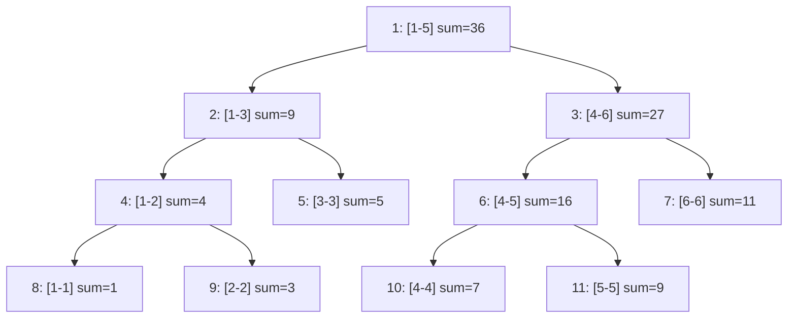

# 算法与数据结构


### 搜索

#### 双向搜索


#### 折半搜索


### 动态规划

#### 状压DP

状压DP通过**位运算**将复杂的状态压缩为整数或位集，从而高效处理状态转移。

**例题**

 [蓝桥杯 2024 国 B\ 跳石头 - 洛谷](https://www.luogu.com.cn/problem/P10914)

**代码**

```c++
#include <iostream>
#include <bitset>
using namespace std;

const int MAXN = 40005;

int n, c[MAXN], maxx = 0;
bitset<MAXN> dp[MAXN];

int main() {
    cin >> n;
    for (int i = 1; i <= n; ++i) {
        cin >> c[i];
    }
    for (int i = n; i >= 1; --i) {
        dp[i].reset();
        dp[i].set(c[i]);
        int j1 = i + c[i];
        if (j1 <= n) {
            dp[i] |= dp[j1];
        }
        int j2 = 2 * i;
        if (j2 <= n) {
            dp[i] |= dp[j2];
        }
        maxx = max(maxx, (int)dp[i].count()); // 注意这里 (int) 类型转化
    }
    cout << maxx << endl;
    return 0;
}
```


### 图论

#### 最短路

##### Floyd算法

**用途**：求**任意**两个节点间最短路，适用任何图。

**实现**：f[x] [y] = min(f[x] [k] + f[k] [y]),f[x] [y] 就是节点x 到节点y 的最短路长度。

**代码示例**：

```c++
for (int k = 1; k <= n; k++) {  //这里的k就表示中间经过的结点
  for (int x = 1; x <= n; x++) {
    for (int y = 1; y <= n; y++) {
      f[x][y] = min(f[x][y], f[x][k] + f[k][y]);
    }
  }
}
```

**思考**：为什么这样能体现答案是完备正确的？

最外层k的含义就是，仅经过前k个中间节点，x到y的最短路，每一次更新相对“仅经过前k个中间节点”这个条件是完备的，最后一次更新后，也就完成了“可以经过所有节点的最短路”


##### Bellman–Ford 算法


##### Dijkstra 算法

**用途**：求解**非负权图**上**单源**最短路。

**实现**：

1.将节点分成两个子集，为已知最短路的点集（S）和未确定的点集（T），初始状态除了起点所有节点都为T。

2.重复以下操作：

​	1.从T中选取最短路长度最小的节点，移到S。

​	2.对刚刚移动的节点所有的出边进行松弛操作。

3.直至T集合空。

**示例代码**：

```c++
const int MAXN = 1e5 + 5;   // 根据题目规模调整最大顶点数
const int INF = 0x3f3f3f3f; // 满足 INF*2 < INT_MAX

struct Edge {
    int to;     // 目标顶点
    int weight; // 边权
};

struct Node {
    int distance;   // 当前距离
    int vertex_id;  // 顶点编号
    
    // 比较运算符重载
    bool operator>(const Node& other) const {
        return distance > other.distance;
    }
};

vector<Edge> graph[MAXN];    // 邻接表存图
int dist[MAXN];              // 存储最短距离
bool processed[MAXN];        // 标记最短距离是否已确定

// 优化堆内存分配，这个并不等同于集合T，可视为待处理缓冲区
// priority_queue 默认最大堆，而greater<>将优先队列改为最小堆
priority_queue<Node, vector<Node>, greater<>> pq; 

void dijkstra(int total_vertices, int start) {
    // 初始化距离数组
    memset(dist, 0x3f, (total_vertices + 1) * sizeof(int));
    // 初始化处理标记
    memset(processed, 0, (total_vertices + 1) * sizeof(bool));
    
    dist[start] = 0;
    pq.push({0, start});

    while (!pq.empty()) {
        // 提取当前最小距离顶点
        int u = pq.top().vertex_id;
        pq.pop();
        
        // 跳过已处理顶点（重要优化点）
        if (processed[u]) continue;
        processed[u] = true;

        // 遍历邻接边
        for (auto& edge : graph[u]) {
            int v = edge.to;
            int w = edge.weight;
            
            // 松弛操作
            if (dist[v] > dist[u] + w) {
                dist[v] = dist[u] + w;
                pq.push({dist[v], v}); // 允许重复入队，堆会自动处理
            }
        }
    }
}
```


##### Johnsen 算法


#### 最小生成树

最小生成树即为**边权和最小**的生成数。

##### Kruskal 算法

把所有边从小到大排列，选取最小且不会连通的边。

**例题**

[P1195 口袋的天空 - 洛谷](https://www.luogu.com.cn/problem/P1195)

**代码**

```c++
#include <algorithm>
#include <iostream>
using namespace std;

int fa[1010];  // 定义根节点
int n, m, k;

struct edge {
	int u, v, w;
}g[10010];

int count = 0;

void add(int u, int v, int w) {
	count++;
	g[count].u = u;
	g[count].v = v;
	g[count].w = w;
}

// 标准并查集
int findroot(int x) { 
	return fa[x] == x ? x : fa[x] = findroot(fa[x]); 
}

void Merge(int x, int y) {
	x = findroot(x);
	y = findroot(y);
	fa[x] = y;
}

bool cmp(edge A, edge B) { return A.w < B.w; }

// Kruskal 算法
void kruskal() {
  int tot = 0;  // 存已选了的边数
  int ans = 0;  // 存总的代价
  for (int i = 1; i <= m; i++) {
    int xr = findroot(g[i].u), yr = findroot(g[i].v);
    if (xr != yr) {   // 如果待加入的边根节点不一样
      Merge(xr, yr);  // 合并
      tot++;          // 边数增加
      ans += g[i].w;  // 代价增加
    }
    if (tot >= (n - k)) {  // 检查选的边数是否满足 k 个棉花糖
      cout << ans << '\n';
      return;
    }
  }
  cout << "No Answer\n";  // 无法连成
}

int main() {
  cin >> n >> m >> k;
  for (int i = 1; i <= n; i++) {  // 初始化
    fa[i] = i;
  }
  for (int i = 1; i <= m; i++) {
    int u, v, w;
    cin >> u >> v >> w;
    add(u, v, w);  // 添加边
  }
  sort(g + 1, g + m + 1, cmp);  // 先按边权排序
  kruskal();
  return 0;
}
```


##### Prim 算法

**例题**

[P3366 【模板】最小生成树 - 洛谷](https://www.luogu.com.cn/problem/P3366)

**代码**

```c++
// 二叉堆优化的Prim算法实现最小生成树(MST)
#include <cstring>
#include <iostream>
#include <queue>
using namespace std;

constexpr int MAX_N = 5050;      // 最大节点数
constexpr int MAX_M = 2e5 + 10;  // 最大边数

// 边结构体：to-目标节点, weight-边权重, next-下一条边的索引
struct Edge {
  int to, weight, next;
} edges[MAX_M * 2];  // 无向图需要存双向边

int node_count, edge_count;  // 节点数和边数
int head[MAX_N];             // 链式前向星的头指针数组
int edge_index = 0;          // 当前边的索引

int min_edge[MAX_N];         // 记录连接到每个节点的最小边权
bool in_mst[MAX_N];          // 标记节点是否已在MST中

int total_cost = 0;  		 // MST的总权值
int mst_node_count = 0;      // 已加入MST的节点计数

// 添加无向边
void addEdge(int u, int v, int w) {
  edge_index++;
  edges[edge_index] = {v, w, head[u]};
  head[u] = edge_index;
}

// 优先队列节点：node-节点编号, key-当前最小边权
struct QueueNode {
  int node, key;
};

// 优先队列比较函数（最小堆）
bool operator<(QueueNode const& a, QueueNode const& b) {
  return a.key > b.key;  // 小顶堆：权重小的优先
}

// 最小堆优化选择过程
// priority_queue 默认使用元素 operator< 比较，而前面已经重载 < 了
priority_queue<QueueNode> min_heap;  

void Prim() {
  // 初始化：所有边权设为无穷大
  memset(min_edge, 0x3f3f3f3f, sizeof(min_edge));
  min_edge[1] = 0;  // 从节点1开始（可任选起点）

  min_heap.push({1, 0});

  while (!min_heap.empty() && mst_node_count < node_count) {
    // 获取当前最小权值的节点
    int u = min_heap.top().node;
    int key = min_heap.top().key;
    min_heap.pop();

    // 跳过已处理的节点
    if (in_mst[u]) {
      continue;
    }

    // 将节点加入MST
    in_mst[u] = true;
    mst_node_count++;
    total_cost += key;

    // 遍历u的所有邻接边
    for (int i = head[u]; i; i = edges[i].next) {
      int v = edges[i].to;
      int w = edges[i].weight;

      // 如果找到更小的边权且v不在MST中
      if (!in_mst[v] && w < min_edge[v]) {
        min_edge[v] = w;
        min_heap.push({v, w});
      }
    }
  }
}

int main() {
  cin >> node_count >> edge_count;

  // 构建无向图
  for (int i = 1, u, v, w; i <= edge_count; ++i) {
    cin >> u >> v >> w;
    addEdge(u, v, w);
    addEdge(v, u, w);  // 无向图添加双向边
  }

  Prim();  // 执行Prim算法

  // 输出结果：如果包含所有节点则输出总权值，否则输出无解
  if (mst_node_count == node_count) {
    cout << total_cost;
  } else {
    cout << "orz";  // 图不连通，无法形成MST
  }

  return 0;
}
```


## 数据结构

#### 链表

```c++
// 链表节点模板
template<typename T>
struct ListNode {
    T data;  // 该点的数据
    ListNode<T>* next;  // 指向下一个点的位置指针
    ListNode(const T& val) : data(val), next(nullptr) {}
};

// 链表模板类
template<typename T>
class LinkedList {
private:
    ListNode<T>* head;
    ListNode<T>* tail;

public:
    // 构造函数
    LinkedList() : head(nullptr), tail(nullptr) {}
    
    // 析构函数 ，有 new 操作，就要有相应的 delete
    ~LinkedList() {
        // 很常见的操作，就是用一个暂时的指针操作所有内容
        ListNode<T>* current = head;
        
        while (current) {
            ListNode<T>* next = current->next;
            delete current;
            current = next;
        }
    }
    
    // 尾部插入
    void push_back(const T& value) {
        // 先建立一个新的节点指针，并赋值value
        ListNode<T>* newNode = new ListNode<T>(value);
        
        // 注意链表思维，不是设置一个连贯的数组，而是将不同的数连接
        if (!head) {
            head = tail = newNode;
        } else {
            tail->next = newNode;
            tail = newNode;
        }
    }
    
    // 打印链表
    void print() const {
        ListNode<T>* current = head;
        while (current) {
            cout << current->data << " ";
            current = current->next;
        }
        cout << endl;
    }
};
```


#### 线段树

**特点：**

根节点表示整个区间[1,n]，非叶子节点地柜二分区间，叶子结点储存单个元素值。



**核心操作时间复杂度** ：

|   操作   | 时间复杂度 |
| :------: | :--------: |
|   建树   |    O(n)    |
| 区间查询 |  O(log n)  |
| 区间更新 |  O(log n)  |
| 单点更新 |  O(log n)  |

**例题：**

[P3372 【模板】线段树 1 - 洛谷](https://www.luogu.com.cn/problem/P3372)

**代码：**

```c++
#include <iostream>
using namespace std;
using LL = long long;  

#define MAX_N 100005
#define MAX_TREE_SIZE 220000

LL n;  // 序列长度                                
LL orig_arr[MAX_N];  // 原始数组                 
LL seg_tree[MAX_TREE_SIZE];  // 线段树储存区间和         
LL lazy[MAX_TREE_SIZE];  // 懒标记

// 构建线段树
void build(LL left, LL right, LL node_idx) {
  if (left == right) {
    seg_tree[node_idx] = orig_arr[left];
    return;
  }

  // 分治
  LL mid = left + ((right - left) >> 1); // 防止溢出

  build(left, mid, node_idx << 1);
  build(mid + 1, right, (node_idx << 1) | 1);

  seg_tree[node_idx] = seg_tree[node_idx << 1] + seg_tree[(node_idx << 1) | 1];  // 回溯更新当前节点
}

// 区间更新
void update(LL left, LL right, LL delta, LL curr_left, LL curr_right, LL node_idx) {
  // 区间完全被覆盖就更新 （这里的解释放在最后面）
  if (left <= curr_left && curr_right <= right) {
    seg_tree[node_idx] += (curr_right - curr_left + 1) * delta;
    lazy[node_idx] += delta; 
    return;
  }

  LL mid = curr_left + ((curr_right - curr_left) >> 1);
  if (lazy[node_idx]) {
    // 更新之前未更新的懒标记
    seg_tree[node_idx << 1] += lazy[node_idx] * (mid - curr_left + 1);
    seg_tree[(node_idx << 1) | 1] += lazy[node_idx] * (curr_right - mid);

    // 下推懒标记
    lazy[node_idx << 1] += lazy[node_idx];
    lazy[(node_idx << 1) | 1] += lazy[node_idx];
    lazy[node_idx] = 0; // 清除当前标记
  }

  if (left <= mid) {
    update(left, right, delta, curr_left, mid, node_idx << 1);
  }
  if (right > mid) {
    update(left, right, delta, mid + 1, curr_right, (node_idx << 1) | 1);
  }

  // 更新当前节点区间和
  seg_tree[node_idx] = seg_tree[node_idx << 1] + seg_tree[(node_idx << 1) | 1];
}

// 区间查询(这里是特例查询和)
LL query_sum(LL qry_left, LL qry_right, LL curr_left, LL curr_right, LL node_idx) {
  // 当前节点区间完全在查询区间内
  if (qry_left <= curr_left && curr_right <= qry_right) {
    return seg_tree[node_idx];
  }

  LL mid = curr_left + ((curr_right - curr_left) >> 1);
  // 下推现有惰性标记（与上面相同含义）
  if (lazy[node_idx]) {
    seg_tree[node_idx << 1] += lazy[node_idx] * (mid - curr_left + 1);
    seg_tree[(node_idx << 1) | 1] += lazy[node_idx] * (curr_right - mid);
    lazy[node_idx << 1] += lazy[node_idx];
    lazy[(node_idx << 1) | 1] += lazy[node_idx];
    lazy[node_idx] = 0;  // 清除当前标记
  }

  LL sum = 0;
  // 递归查询左右子树
  if (qry_left <= mid) {
    sum = query_sum(qry_left, qry_right, curr_left, mid, node_idx << 1);
  }
  if (qry_right > mid) {
    sum += query_sum(qry_left, qry_right, mid + 1, curr_right, (node_idx << 1) | 1);
  }

  return sum;
}

int main() {
  ios::sync_with_stdio(false);  
  cin.tie(nullptr);             

  LL query_count;  
  cin >> n >> query_count;

  for (LL i = 1; i <= n; ++i) {
    cin >> orig_arr[i];
  }

  build(1, n, 1);

  while (query_count--) {
    LL op_type, left_bound, right_bound;
    cin >> op_type >> left_bound >> right_bound;

    if (op_type == 2) {  
      cout << query_sum(left_bound, right_bound, 1, n, 1) << '\n';
    } else {
      LL delta;
      cin >> delta;
      update(left_bound, right_bound, delta, 1, n, 1);
    }
  }
  return 0;
}

/*
原始数据[1,7]  更新[2,5]  更新区间未能完全包含被更新区间
查询[1,3],[4,6] 都不满足，继续递归子节点
查询[1,2]过 [3,3]被完全包含，更新 [4,5]被完全覆盖，更新 [6,6]过
*/
```


## 杂项

#### 全排列

**函数原型**

```c++
bool next_permutation(Iterator first, Iterator last);
bool prev_permutation(Iterator first, Iterator last);
```

**例题**

[P1706 全排列问题 - 洛谷](https://www.luogu.com.cn/problem/solution/P1706)

**代码**

```c++
#include <algorithm> // next_permutation 头文件
#include <iostream>  
using namespace std;
int main() {
  int n ,a[10] ,factorial=1 ;
  cin >> n;
  for (int i = 1; i <= n; i++) {
    a[i] = n - i + 1;  
    //这一步倒序处理是为了之后的顺序排序
    //因为第一个是4 3 2 1，下一个就是1 2 3 4
    factorial *= i;  // 顺便计算 n!
  }  
  for (int i = 1; i <= factorial; i++) {
    next_permutation(a + 1, a + n + 1); 
    //next_permutation是bool函数，这里就当直接忽视了
    for (int j = 1; j <= n; j++) {
      cout << "    " << a[j]; 
    }
    cout << endl;
  }
  return 0;
}
```

**更好的代码**

```c++
#include <algorithm>
#include <iostream>
using namespace std;
int main() {
  int n, a[10];
  cin >> n;
  for (int i = 1; i <= n; i++) 
    a[i] = i;
  //利用 bool 的性质，直接使用do-while结构
  do {
    for (int i = 1; i <= n; i++) 
      cout << "    " << a[i];
    cout << endl;
  } while (next_permutation(a + 1, a + n + 1));
  return 0;
}
```

**习题**

[P12593 沉石鱼惊旋 - 洛谷](https://www.luogu.com.cn/problem/P12593?contestId=245376)


#### #include  < bitset >

**初始化**

```c++
bitset<8> b1;          // 默认全0: 00000000
bitset<8> b2(0x0F);    // 用十六进制初始化: 00001111
bitset<8> b3("101010"); // 用字符串初始化: 00101010（从右到左填充）
```

**设置/重置位**

```c++
b1.set();       // 所有位设为1: 11111111
b1.set(3,1);    // 第3位设为1: 00001000（索引从右到左，0开始）
b1.reset(3);    // 第3位设为0: 00000000
b1.flip();      // 所有位取反: 11111111 → 00000000
b1.flip(2);     // 第2位取反: 00000100 → 00000000
```

**访问位**

```c++
bool bit = b1.test(2); // 检查第2位是否为1
bool bit = b1[2];      // 等价于test(2)
b1[2] = 1;             // 直接修改第2位
```

**位运算**

```c++
bitset<4> a("1010"), b("1100");
a & b;  // 按位与: 1000
a | b;  // 按位或: 1110
a ^ b;  // 按位异或: 0110
~a;     // 按位取反: 0101
//注：bitset 类型不能直接转化成 int
```

**查询**


```c++
b1.count();  // 返回1的位数（如00001111 → 4）
b1.size();   // 返回总位数（如8）
b1.any();    // 是否有至少一个1（true/false）
b1.none();   // 是否全0（true/false）
b1.all();    // 是否全1（C++11起支持）
```

**类型转换**

```c++
unsigned long val = b2.to_ulong();  // 转为无符号长整型（如00001111 → 15）
string s = b3.to_string();          // 转为字符串（如"00101010"）
```


#### 位运算

**1. 位与运算符  &**

对两个二进制数的每一位进行与运算，只有当两位都是1时结果才为1。

```cpp
int a = 5;  // 二进制 0101
int b = 3;  // 二进制 0011
int result = a & b; // 结果为 1，二进制 0001
```

**2. 位或运算符  |**

对两个二进制数的每一位进行或运算，只要有一位为1，结果就为1。

```cpp
int a = 5;  // 二进制 0101
int b = 3;  // 二进制 0011
int result = a | b; // 结果为 7，二进制 0111
```

**3. 位异或运算符  ^**

对两个二进制数的每一位进行异或运算，当两位不同（一个为1一个为0）时结果为1。

```cpp
int a = 5;  // 二进制 0101
int b = 3;  // 二进制 0011
int result = a ^ b; // 结果为 6，二进制 0110
```

**4. 取反运算符  ~**

对一个二进制数的每一位进行取反运算，0变为1，1变为0。

```cpp
int a = 5;  // 二进制 0101
int result = ~a; // 结果为 -6，二进制 1010（补码表示）
```

**5. 左移运算符  <<**

将一个数的二进制位向左移动指定的位数，左移一位相当于乘以2。

```cpp
int a = 5;  // 二进制 0101
int result = a << 1; // 结果为 10，二进制 1010
```

**6. 右移运算符  >>**

将一个数的二进制位向右移动指定的位数，右移一位相当于整除2。

```cpp
int a = 5;  // 二进制 0101
int result = a >> 1; // 结果为 2，二进制 0010
```


#### 并查集

```c++
int fa[N];  // N为元素数量

// 初始化，大多时嵌入前面代码部分
void init() {
    for (int i = 0; i < N; i++) fa[i] = i;
}

// 查找父元素
int find(int x){
    return fa[x] == x ? x : fa[x] == find(fa[x]); 
} 

// 合并集合
void union(int x,int y){
    x = findroot(x); // 反正不是&，修改也没关系
	y = findroot(y);
	fa[x] = y; // 将x的根节点设置成y的。
}


```

